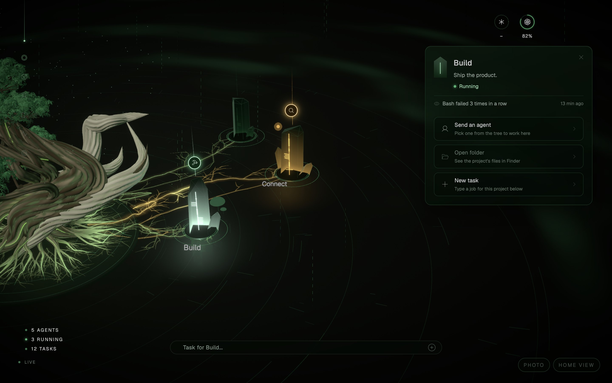
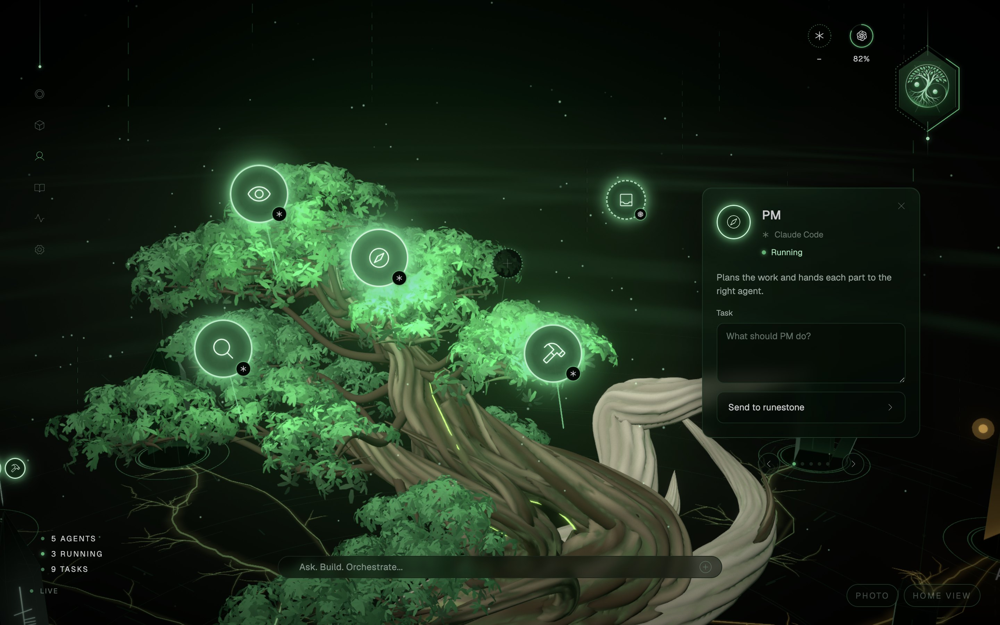

# Agentic Grove

A desktop interface for running and watching AI agents. It is meant to sit open on a third
screen all day while you work on your main screens: you glance over, see how many agents are
working and whether anything needs you, and look away again.

It is not a chat app. It is a cockpit.


*The grove growing, in demo mode: day one, a few weeks in, and a full grove under load. A real
grove starts empty and grows a stone for each project you connect.*

**Status: early, and changing quickly.** The grove shows your real projects and agent sessions,
live, with usage headroom per provider, and sends agents to work in your projects through your own
Claude Code or Codex.

MIT licensed. No telemetry, ever.

## What you can do with it

- **See your work at a glance.** Each project is a stone. It lights while an agent works there and
  turns amber, the grove's one warning colour, when an agent is waiting for you. A git worktree
  stands beside its repository as a twin stone.
- **Tell PM what needs doing.** Type a job into the console at the bottom. PM, the project manager
  on the tree, plans it, hands each part to the agent whose job it is (Researcher finds things
  out, Builder makes changes, and any agents you add), checks the work and reports back. Bigger
  jobs get a plan you agree to before anything changes. It all runs in Terminal, in that project,
  as your own Claude Code or Codex.
- **Or send one agent yourself.** Pick a stone and an agent from the tree, or start the job with
  its name ("@builder fix the tests"). The console shows who would take it and where before
  anything is sent, and one click changes either.
- **Save the jobs you repeat.** A saved task on a stone runs in one click. When three sessions in a
  project start with the same prompt, the Grove offers to save it, and remembers if you say no.
- **Leave a note for next time.** On a stone, an agent or the tree. It stays out of the way until
  work next starts there, then shows once.
- **Ask about your own week.** "What did I do yesterday?" is answered by the Grove itself, from
  the records on your Mac, and the stones involved light in the order you came to them.
- **Know how much you have left.** Five-hour and weekly headroom for Claude and ChatGPT, each
  figure marked official, counted or unknown.
- **Use it without a mouse.** Arrow keys move between stones, Enter opens one, Esc goes back.
- **Take its picture.** Press P for photo mode: the interface steps aside and you can save a large image.
- **Leave it open all day.** When nothing has happened for a few seconds it draws less, and hidden
  it uses almost nothing.

| | |
| --- | --- |
|  |  |
| Choose a stone to see its state and what you can do there. | PM and its team on the tree. Send PM, or any one agent. |

## Where it runs, and what it works with

| | |
| --- | --- |
| **macOS** (Apple Silicon) | Supported. This is the only platform today. |
| **Windows** | Not yet, and **looking for a contributor**: the maintainer has no Windows machine. See [CONTRIBUTING.md](CONTRIBUTING.md) for what the port involves. |
| **Linux** | Not yet. Contributions welcome; most of the Mac code carries over. |

The Grove works with the two AI providers most people use today: **Claude** (the Claude app,
Claude Code, Cowork) and **ChatGPT** (the ChatGPT app, Codex, Dots). Ideally you have the Claude
or ChatGPT desktop app as well as the command-line tools; if something is missing, the first-launch
walkthrough and Settings help you get it in a click or two.

Those two are a starting point, not a wall. Other providers and locally run models (Ollama, LM
Studio and the like) can be added: each tool the Grove understands is one small adapter in
`core/harnesses/`, and the contract is in its README. One for Cursor is already written but has
never been tested on real data. Contributions are welcome.

---

## Getting started

You need a Mac with Apple Silicon (M1 or later) running macOS 13 Ventura or newer. Building it
yourself also needs [Node.js](https://nodejs.org) 22 or newer.

### Download

Builds appear under [Releases](https://github.com/Adiezc/agentic-grove/releases) as a disk image
(`Agentic-Grove-<version>-arm64.dmg`).

1. Open the disk image and drag **Agentic Grove** onto **Applications**.
2. Open it. macOS will refuse the first time, because the app is not signed with a paid Apple
   developer certificate.
3. Open **System Settings → Privacy & Security**, scroll down, and click **Open Anyway** beside
   Agentic Grove. Confirm once more. From then on it opens normally.

A newer version replaces the app the same way. Your projects, agents and settings live in
`~/.agentic-grove`, outside the app, so they are kept.

### Build it yourself

**The easy way:** if you use Claude Code or Codex, ask it:

> Install Agentic Grove for me by following https://github.com/Adiezc/agentic-grove/blob/main/INSTALL.md

**By hand:**

```bash
git clone https://github.com/Adiezc/agentic-grove.git
cd agentic-grove
npm ci
npm run app      # builds the app into ~/Applications
open ~/Applications/"Agentic Grove.app"
```

(`npm run dev` runs it in development mode instead, for working on the Grove itself.)

### First launch

PM walks you through the grove. The second card has one button, **Get ready**. It looks
for Claude Code and Codex first (including the copies inside the Claude and ChatGPT apps), and
only installs what is missing. Then it does whichever of these is still needed: install Claude
Code, sign you in (in Terminal and your browser, the one step that needs you), and turn on live
updates. If you already have everything, there is nothing to press. Settings has the same
controls, one per tool.

## What it can and cannot see

This project tries hard not to lie to you. Some things are knowable and some are not, and the
interface is built to show the difference rather than hide it.

| Tool | What the Grove can do |
| --- | --- |
| Claude Code (terminal and desktop) | **Watch and send.** Every session, live through its hooks. Sends agents by opening your own Claude Code in Terminal. Official limits when you press Check now |
| Codex | **Watch and send.** Every session, with OpenAI's own five-hour and weekly figures. Sends agents by opening your own Codex in Terminal |
| Claude Cowork | **Link only.** Everyday work in the Claude app; the Grove opens it |
| ChatGPT Dots | **Link only.** OpenAI's always-on agents; no public API yet |

"Link only" means the Grove can open it for you and nothing more, and the interface shows those
as loose fireflies rather than agents on the tree. A figure the Grove cannot know honestly is shown
as unknown rather than guessed.

Three limits worth knowing before you rely on it:

- **The Grove starts work; it does not run it.** A job you send runs in a Terminal window as your
  own Claude Code or Codex, on your own plan. The Grove watches it, and cannot stop it or answer
  for it; the Terminal window can.
- **Claude's official limits are read only when you ask.** Claude Code's token use is counted from
  its records all the time. The official five-hour and weekly percentages come from running your
  Claude Code once, when you press Check now in Settings. It is off until you switch it on.
- **History is as good as the records.** A session records when it started and when it was last
  written to. The Grove will not claim you worked on something in between.

## Privacy and the network

Everything the Grove reads stays on your Mac. It sends nothing about you, your projects or your
usage anywhere. The one network request it makes by itself is **checking for updates**: once a
day, while you are online, it asks GitHub's public releases page for the newest version number.
That request carries no identifier. It exists so you can hear about new versions, and you can turn
it off in Settings. The Grove never installs anything by itself; you download new versions when
you choose.

One more thing reaches the network, and only when you press it: **Check now** under Settings →
Claude limits runs your own Claude Code once to read your official limits. That is one small
request to Anthropic on your plan (about 600 tokens), made by Claude Code, not by the Grove. It is
off by default and never runs on a timer.

Your grove (projects, agents, settings) lives in `~/.agentic-grove/grove.json`, outside the app,
so an update never touches it. It is plain JSON and meant to be edited by hand if you like.

**How the app protects your Mac.** The window that draws the grove cannot touch your files or run
programs itself. It can only ask the app for a short list of actions, each checked before it
happens. It cannot load anything from the internet, open web pages or windows of its own, or ask
for your camera, microphone or location. The packaged app also refuses to be used as a back door
for running other code. The details, and a check that keeps them in place
(`npm run verify:security`), are in `electron/security.ts`. Found a hole? Please report it
privately, as [SECURITY.md](SECURITY.md) describes, rather than in a public issue.

## Uninstalling

Settings → Uninstall. It takes the Grove's lines out of Claude Code's settings (if you turned live
updates on), moves the app to the Trash and quits. Your grove in `~/.agentic-grove` is kept unless
you tick "Also remove my grove". Your project folders, and Claude Code and Codex themselves, are
never touched, and everything removed goes to the Trash.

## For contributors

**The most wanted contribution is a Windows version.** [CONTRIBUTING.md](CONTRIBUTING.md) lists
the Mac-specific pieces and where they live.

```bash
npm run scan     # print every agent session on this machine
npm run watch    # the same thing on the live poll loop
npm run verify   # check the scanner against the raw files, independently
npm run verify:routing  # PM's rules for which tool takes which job
npm run typecheck
npm run app      # build the Mac app into ~/Applications
npm run dmg      # build release/Agentic-Grove-<version>-arm64.dmg for a GitHub release
```

Each part with rules of its own has a `verify:` script beside it (`spawn`, `console`, `attention`,
`health`, `places`, `readiness`, `reliability`, `pairings`, `tells`, `probe`, `history`, `codex-usage`, `twins`, `suggest-runes`, `notes`, `security`); they run in seconds and touch nothing of
yours.

`verify` is the one worth knowing about. It counts the files on disk with its own separate code
and fails if the scanner disagrees, because a wrong number looks exactly like a right one.

## Principles

1. **Read-only towards other people's tools.** The Grove never writes to another tool's session
   or transcript data. It may write to another tool's *config* — installing Claude Code hooks,
   for instance — only with your explicit consent, showing the exact change, and reversibly.
2. **Never invent a number.** Unknown is a valid and honest state. Every figure carries its
   provenance: official, measured, estimate or unknown.
3. **Minimal text.** If it can be a light, a colour or a movement, it should not be a word.
4. **Calm by default.** It is on screen all day. Nothing pulls the eye unless it has earned it.
5. **Credit generously.** This exists because other people published their work. See
   [CREDITS.md](CREDITS.md).

## Documents

- [CONTRIBUTING.md](CONTRIBUTING.md) — how to help, starting with the Windows port
- [SECURITY.md](SECURITY.md) — how to report a security problem privately
- [CREDITS.md](CREDITS.md) — every project this borrows from, what was taken, under which licence
- [DECISIONS.md](DECISIONS.md) — append-only log of architectural decisions and why
- [ROADMAP.md](ROADMAP.md) — the build plan, and ranked ideas for future sessions
- `core/harnesses/README.md` — the adapter contract, if you want to add support for another tool

## Licence

MIT. See [LICENSE](LICENSE).
